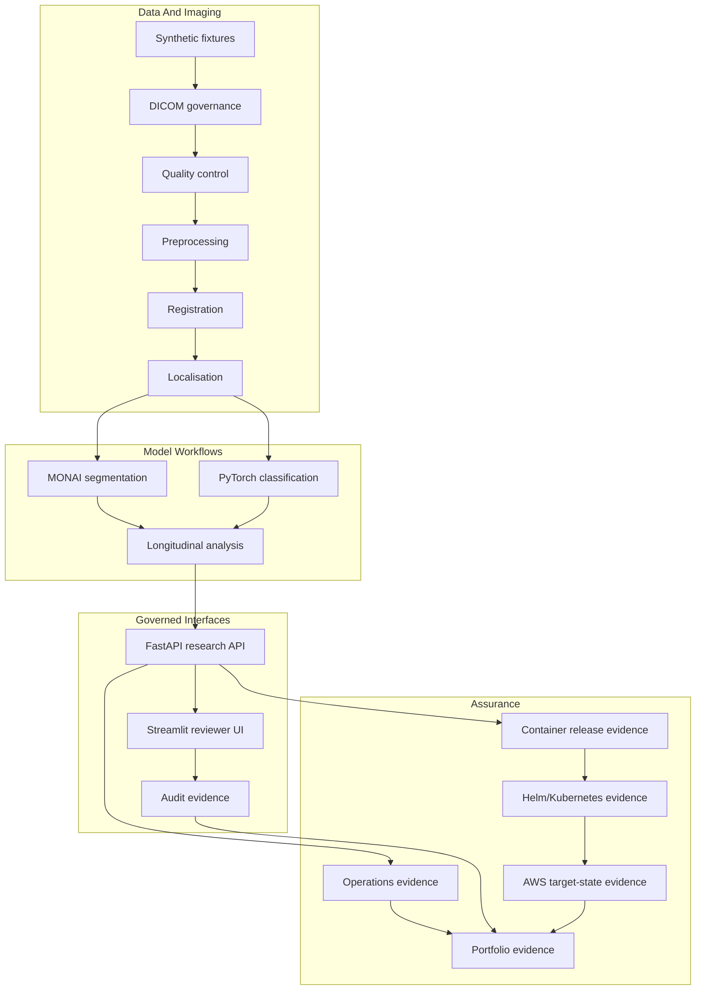
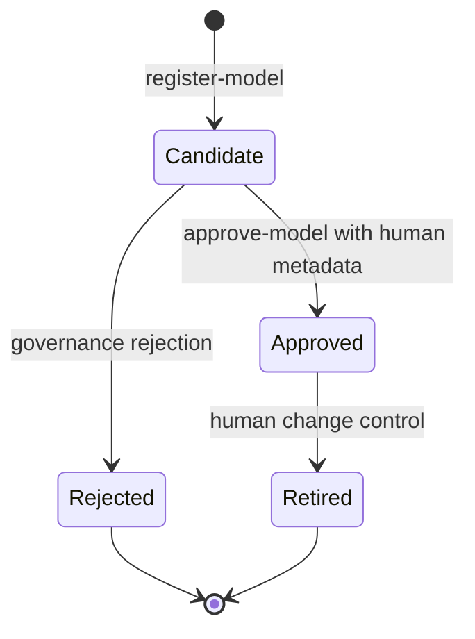
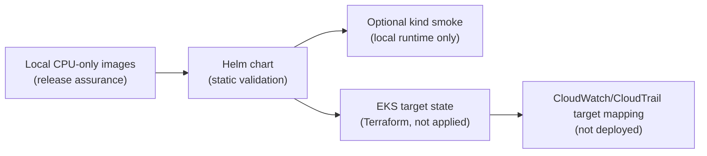
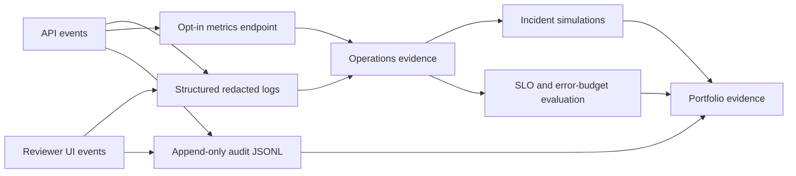

# Final End-To-End Architecture

This platform is a research and engineering demonstrator. Outputs are intended for technical
evaluation and human review only and must not be used for clinical diagnosis or patient-management
decisions.

Milestone 18 consolidates the architecture view across Milestones 1-17. The system demonstrates an
end-to-end medical-imaging AI engineering workflow using synthetic or publicly available
de-identified data only. It does not deploy AWS resources, claim NHS approval, claim medical-device
approval, automate model promotion, automate retraining, or automate rollback.

## Status Legend

- Implemented locally: source code and tests exist in this repository.
- Locally executed: deterministic local command paths produce ignored artefacts.
- Statically validated: manifests or infrastructure definitions are validated without live
  deployment.
- Simulated: deterministic local evidence models an operational process.
- Target-state only: infrastructure design exists but is not deployed.

## End-To-End Flow

```mermaid
flowchart LR
    A["Synthetic CT generation<br/>(locally executed)"] --> B["DICOM fixtures, ingestion<br/>and de-identification<br/>(locally executed)"]
    B --> C["Technical image QC<br/>(locally executed)"]
    C --> D["CT preprocessing<br/>(locally executed)"]
    D --> E["Longitudinal registration<br/>(locally executed)"]
    E --> F["Adrenal-region localisation<br/>(locally executed)"]
    F --> G["Synthetic segmentation<br/>(locally executed)"]
    F --> H["Calibrated classification<br/>(locally executed)"]
    G --> I["Longitudinal lesion analysis<br/>(locally executed)"]
    H --> I
    I --> J["Governed FastAPI<br/>(implemented locally)"]
    J --> K["Reviewer UI<br/>(implemented locally)"]
    G --> L["Model registry<br/>(simulated governance evidence)"]
    H --> L
    J --> M["Monitoring, drift, audit<br/>(simulated synthetic evidence)"]
    K --> M
    J --> N["Containers<br/>(locally executed release assurance)"]
    K --> N
    N --> O["Helm/Kubernetes<br/>(static validation plus optional local runtime)"]
    O --> P["AWS target-state IaC<br/>(target-state only, not deployed)"]
    M --> Q["Observability and incident evidence<br/>(simulated operations evidence)"]
    Q --> R["Portfolio evidence pack<br/>(implemented locally)"]
```

## Component Architecture

## Model Lifecycle

Only explicit human approval can move a model to `approved`. Monitoring, SLOs, clean tests, release
evidence, or successful demos do not automatically promote, retrain, deploy, or roll back models.

## Deployment Architecture

Containers and Kubernetes artefacts are engineering deployment evidence. AWS Terraform is
target-state infrastructure-as-code and must not be represented as a live cloud deployment unless an
operator separately deploys it outside this repository's normal validation path.

## Monitoring And Audit Flow

Logs and metrics must not include raw arrays, DICOM pixels, model weights, credentials, direct
identifiers, sensitive payloads, reviewer notes, or unredacted local secret paths.

## Security Boundaries

- Only synthetic or public de-identified data is allowed.
- Generated artefacts, model checkpoints and local evidence stay outside Git.
- API paths are allowlisted and protected against traversal and symlinks.
- Containers and Kubernetes pods run as non-root with read-only root filesystems.
- Metrics are disabled by default and protected when a token is configured.
- AWS target-state design uses private-by-default EKS, governed S3, KMS and CloudTrail boundaries,
  but no AWS resources are deployed by repository validation.
